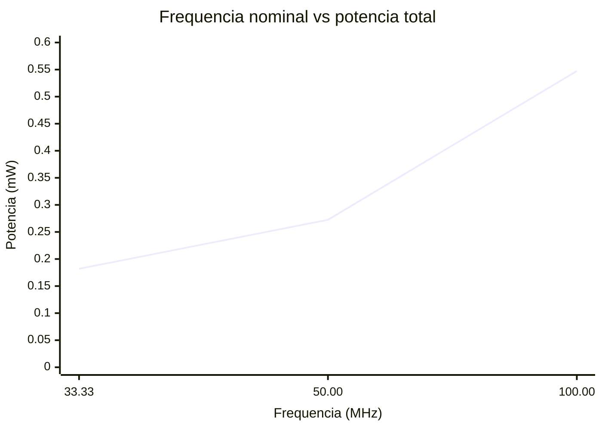
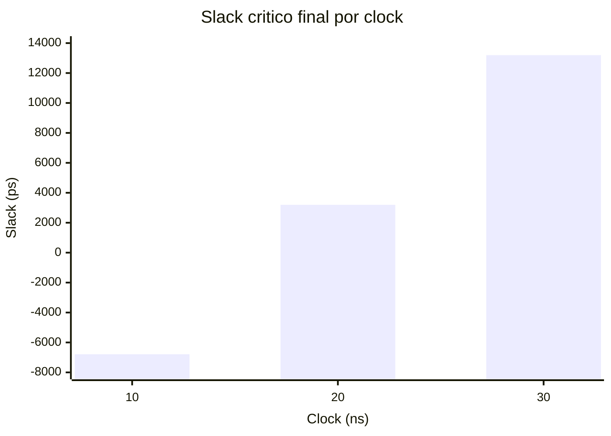
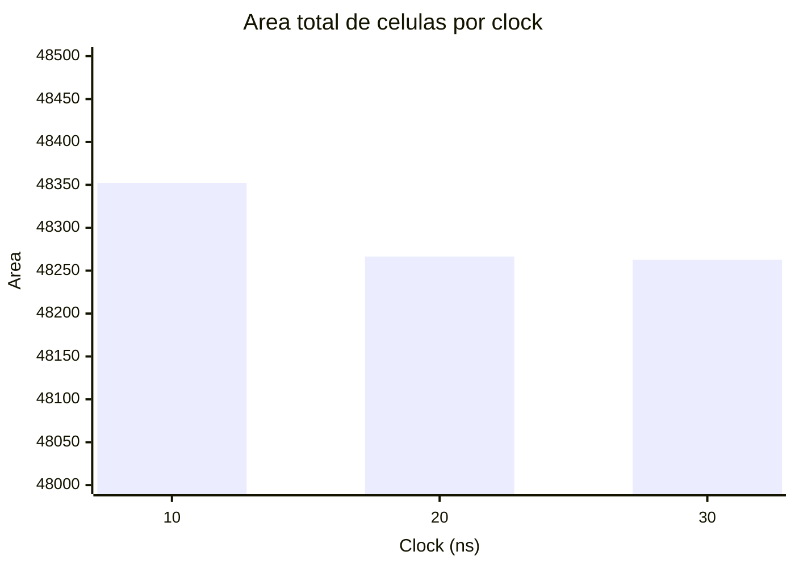
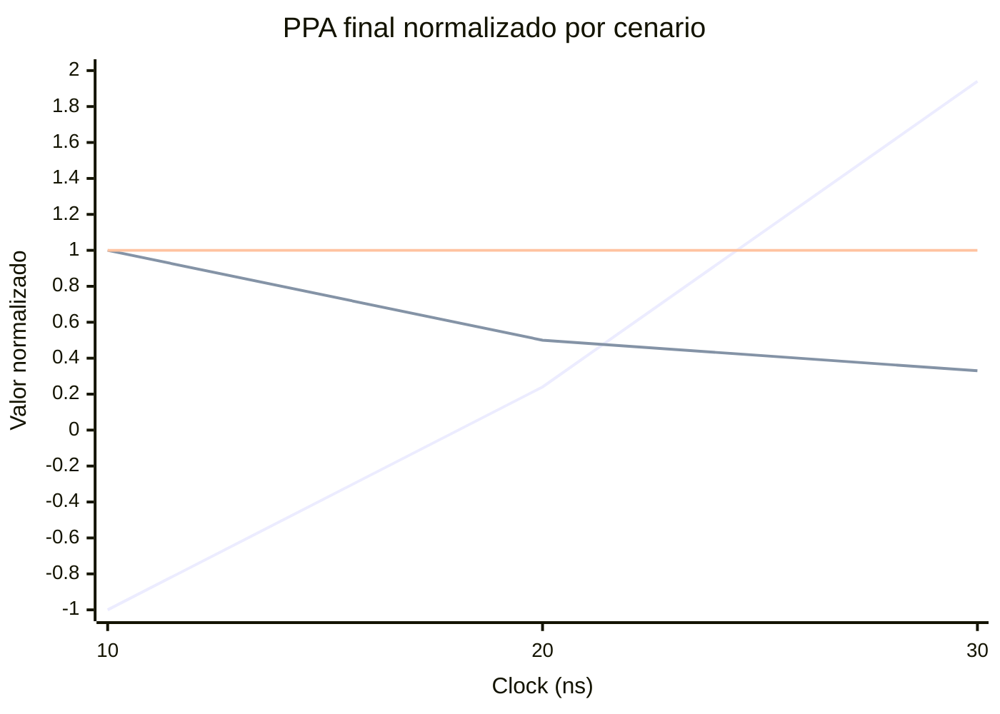

# Relatorio Comparativo PPA - LAB9

## 1. Objetivo e fonte dos dados

Este relatorio apresenta uma analise comparativa dos resultados de sintese do modulo `top` para tres restricoes de clock: 10 ns, 20 ns e 30 ns. A analise usa exclusivamente os reports finais presentes em `reports_10`, `reports_20` e `reports_30`.

Os arquivos disponiveis representam o estado final do fluxo com DFT. Nao ha, nos diretorios finais, reports separados para cada etapa de sintese nem uma versao final equivalente sem DFT. Por isso, a evolucao solicitada por etapa foi adaptada para uma comparacao final entre os tres cenarios de clock, mantendo a limitacao documentada.

## 2. Resumo comparativo

| Clock | Frequencia nominal | Slack critico | TNS | Caminhos violados | Area total | Potencia total | Leakage | Interna | Switching | Instancias | Seq. | Comb. |
|---:|---:|---:|---:|---:|---:|---:|---:|---:|---:|---:|---:|---:|
| 10 ns | 100.00 MHz | -6787.6 ps | -223595.0 ps | 42 | 48352.302 | 5.47280e-04 W | 7.81896e-07 W | 5.09282e-04 W | 3.72158e-05 W | 12159 | 4139 | 8020 |
| 20 ns | 50.00 MHz | 3194.9 ps | 0.0 ps | 0 | 48266.460 | 2.72443e-04 W | 7.82791e-07 W | 2.53608e-04 W | 1.80518e-05 W | 12067 | 4139 | 7928 |
| 30 ns | 33.33 MHz | 13194.9 ps | 0.0 ps | 0 | 48262.698 | 1.81970e-04 W | 7.82696e-07 W | 1.69170e-04 W | 1.20164e-05 W | 12066 | 4139 | 7927 |

## 3. Caminho critico

| Clock | Status | Caminho critico | Atraso do caminho | Slack |
|---:|---|---|---:|---:|
| 10 ns | Violado | `fsm_state_reg[0]/CK -> cpu_rdy` | 1788 ps | -6788 ps |
| 20 ns | Atendido | `fsm_state_reg[1]/CK -> cpu_rdy` | 1805 ps | 3195 ps |
| 30 ns | Atendido | `fsm_state_reg[1]/CK -> cpu_rdy` | 1805 ps | 13195 ps |

No cenario de 10 ns, o caminho critico viola timing porque a restricao de saida de 15 ns torna o tempo requerido negativo para `cpu_rdy`. Ja nos cenarios de 20 ns e 30 ns, o mesmo tipo de caminho externo passa a ter margem positiva, mostrando que o circuito atende timing quando a frequencia alvo e reduzida.

## 4. Graficos

### Desempenho vs potencia

| Frequencia nominal | Potencia total |
|---:|---:|
| 100.00 MHz | 0.547280 mW |
| 50.00 MHz | 0.272443 mW |
| 33.33 MHz | 0.181970 mW |

### Slack final por cenario

### Area final por cenario

### Comparacao final dos PPAs

Como os reports disponiveis sao apenas finais, a comparacao abaixo substitui a evolucao por etapa de sintese. Ela mostra o comportamento final dos tres PPAs observados: performance, potencia e area.

Normalizacao usada: potencia e area relativas ao cenario de 10 ns; performance por slack relativa ao modulo do slack de 10 ns. A area aparece praticamente constante porque a variacao total foi menor que 0,2%.

## 5. Discussao dos impactos nos PPAs

### Performance

O desempenho, medido pela capacidade de atender a restricao temporal, melhora conforme o periodo de clock aumenta. Em 10 ns, o circuito opera no ponto mais agressivo e apresenta slack negativo de -6787.6 ps, com 42 caminhos violados. Em 20 ns, o slack passa para 3194.9 ps, eliminando as violacoes. Em 30 ns, a margem sobe para 13194.9 ps, indicando uma restricao bem mais relaxada.

### Potencia

A potencia total diminui de 0.547280 mW em 10 ns para 0.272443 mW em 20 ns e 0.181970 mW em 30 ns. Essa reducao acompanha a queda da frequencia nominal. A componente interna domina o consumo em todos os cenarios, ficando proxima de 93% da potencia total, enquanto leakage permanece praticamente constante.

### Area

A area total varia pouco entre os tres cenarios: 48352.302 em 10 ns, 48266.460 em 20 ns e 48262.698 em 30 ns. A diferenca entre o maior e o menor valor e de aproximadamente 0,19%, indicando que relaxar o clock reduziu a pressao de otimizacao, mas nao mudou significativamente a estrutura final do circuito.

### Efeito geral

O cenario de 10 ns entrega a maior frequencia nominal, mas nao e viavel temporalmente nos reports finais, pois apresenta WNS negativo e TNS acumulado. Os cenarios de 20 ns e 30 ns atendem timing, com queda clara de potencia e quase nenhum impacto de area. Assim, 20 ns aparece como o ponto mais equilibrado entre desempenho e consumo: atende timing, reduz a potencia pela metade em relacao a 10 ns e mantem area praticamente igual.

## 6. Conclusao

Com base apenas nos reports finais, o circuito nao fecha timing em 10 ns, mas fecha em 20 ns e 30 ns. A reducao da frequencia diminui a potencia quase proporcionalmente, enquanto a area permanece estavel. A principal troca observada e entre frequencia alvo e viabilidade temporal: tentar operar a 100 MHz torna o caminho ate `cpu_rdy` critico demais, enquanto 50 MHz ja oferece margem positiva sem aumento relevante de area.
